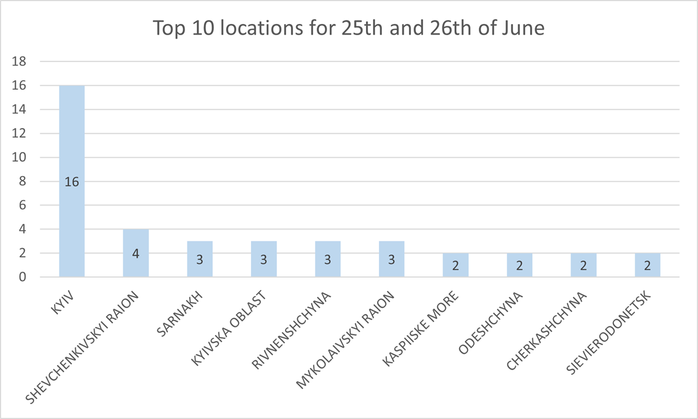

**Please donate to Ukrainian army: https://www.comebackalive.in.ua/ 💙💛**

# Missile Attack Watcher
**Authors**: Pavels Ivanovs (NER implementation for [Ukrainian](telegram.py)) and Kārlis Šteinbergs (NER implementation 
for [English](twitter.py)).

## Goal of the Project
The goal of the project is to aggregate reports about rocket strikes which are happening during the full-scale russian 
invasion of Ukraine in 2022. The goal is achieved by applying Named Entity Recognition (NER) techniques to the news 
reports and extracting geographical locations from those.

## Implementation
### English
For the English part of the project widely used NLP library [spaCy](https://spacy.io/) was used. The out-of-box 
functionality of spaCy NER models for English was already good enough that it did not require any additional training.

The report extraction was happining via the medium of Twitter API.

### Ukrainian
As spaCy does not have support for Ukrainian (yet!), the decision was made to use 
[Stanza](https://stanfordnlp.github.io/stanza/) library for implementing Ukrainian part of the project.

#### NER
Despite Stanza already having a pretty good NER model for Ukrainian, we decided to train the model with open-source 
NER-annotated [corpora](https://github.com/lang-uk/ner-uk). With that we have succeded to increase the F1 score of our 
model to **89.20** compared to initial **86.05**.

#### Lemmatization, Inflection
As the geographic location tokens have been received by NER model, we had to lemmatize and inflect the tokens.

For lemmatization we used a Python library [pymorphy2](https://github.com/kmike/pymorphy2), which is a morphological 
analyzer both for Ukrainian and russian.

As well pymorphy2 was used to inflect the names of multi-word geographic locations, e.g, "Херсоньска область", so that 
all tokens would have the same gender.

#### Transliteration
For making it easier to aggregate results with English we transliterate the names of geographic locations from Cyrillic 
script to Latin with the help of Python library [translit-ua](https://github.com/dchaplinsky/translit-ua).

## Results 
The created solution aggregates information from provided sources and stores them in the human-readable format (CSV 
file). Below is a diagram which displays names of top 10 most reported geographic locations on 25.06-26.06 when russia 
has struck Kyiv with multiple rockets (as you can see Shevchenkovskyi raion, Kyiv, is reported as well).

If you have any suggestion on this project, please feel free to write them in the 
[Issues](https://github.com/pavelsivanovs/missile-attack-watcher/issues) section of this repo. As well, please donate to
Ukrainian Army: https://www.comebackalive.in.ua/!

**Слава Україні! :ukraine:**